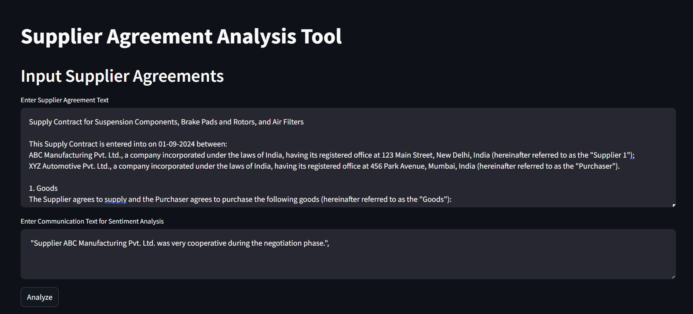
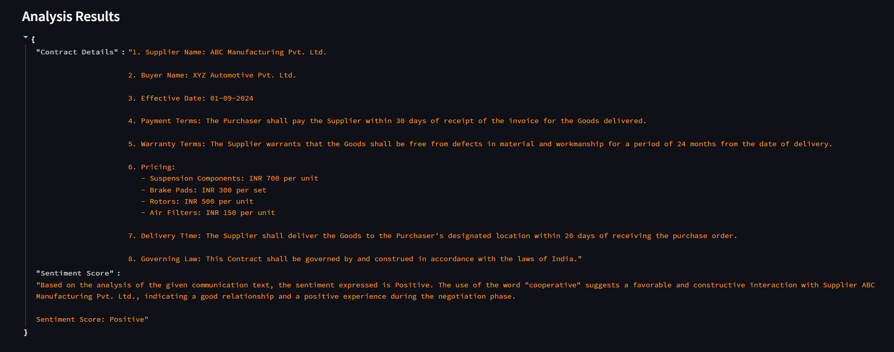

# Contract-Analysis-demo
This project we will try build a demo for contract analysis

To install and run demo use following command

`pip install uv`

`uv pip sync requirements.txt`

Once env is setup ensure that you have LLM api keys and add it to env-variable, In this case I have github model cards `Phi-3-small-8k-instruct`

You might need to modify the code in `src/main.py` file.

All the data used is synthetically created data and not orginal data

- Step 1: run the api `uvicorn main:app --reload` and localhost api will be started at port 8000

- Step 2: run the app `streamlit run frontend.py` and localhost app will be started at port 8501

- Step 3: Add the Contract text and communication text for analysis

- Step 4: Click on Analyze Button and wait for response. 

Here is sample output:

